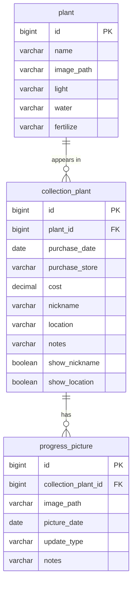
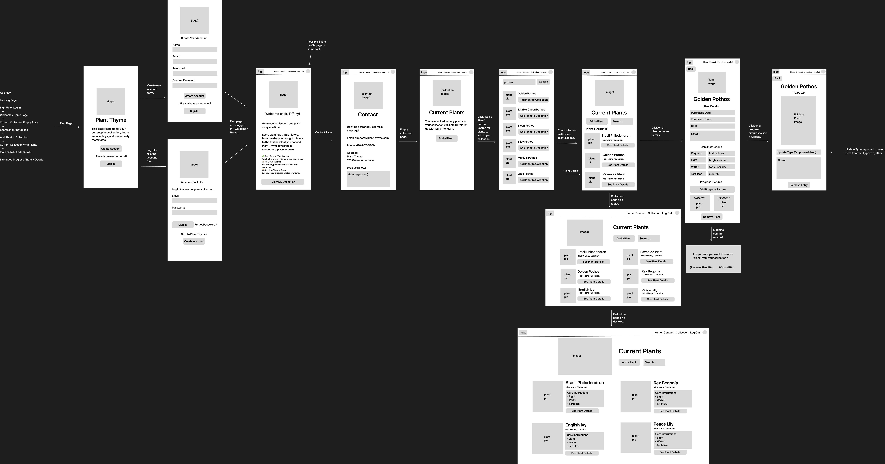

# Plant Thyme 🪴

<div align="center">
  
  
  
  
  
</div>

<div align="center">
  
  
  
  
  
</div>

<!-- TODO: Remove any badge above for a technology you didn't actually use, and add any you're missing. -->

---

<div align="center">
    <a href="#about">About</a> •
    <a href="#features">Features</a> •
    <a href="#tech">Tech Stack</a> •
    <a href="#installation">Installation</a> •
    <a href="#database">Database</a> •
    <a href="#api">API</a> •
    <a href="#visuals">Wireframes</a> •
    <a href="#future">Future Features</a>
</div>

---

<a name="about"></a>

## 💡 About the Project

> _Grow your collection, one plant story at a time._

Plant Thyme is a full-stack houseplant tracking application built to help plant lovers keep their collections organized and watch each plant's story unfold over time.

Instead of trying to remember when you bought a plant, where it came from, when you last repotted it, or what it looked like six months ago, Plant Thyme keeps everything rooted in one place.

Build your personal collection from a plant database, customize details for each individual plant, quickly search through your collection, reference basic care information, and document growth through progress pictures and notes. Whether your plant is pushing out a new leaf, recovering from pests, getting repotted, or simply thriving, Plant Thyme gives you a place to keep track of it all.

---

<a name="features"></a>

## 🧩 Features

### 🌱 Build Your Plant Collection

Add houseplants from the plant database to create your own personal collection.

### 🔎 Search Your Collection

Plants are displayed alphabetically, and the live search feature filters matching plants as you type.

### 🪴 Personalized Plant Cards

Each plant card displays the plant name along with an optional nickname and location. You can choose whether the nickname and location appear on the card.

### 📖 Detailed Plant Profiles

Each plant in your collection has its own details page where you can track and edit:

- Purchase date
- Store
- Cost
- Nickname
- Location
- Personal notes

### ☀️ Care Information

View basic care instructions for each plant, including helpful information for keeping it happy and growing.

### 📷 Progress Picture Gallery

Upload progress pictures to create a visual timeline of each plant's journey.

### 🌿 Progress Picture Details

Every progress picture has its own details page where you can:

- Edit the picture date
- Select a progress type such as Growth, Repotting, Pruning, Pest Treatment, or Other
- Add notes
- Delete the picture
- Move through the plant's pictures chronologically with Previous and Next buttons

### ➕ Add New Plants

Use the Add Plant page to search the plant database and add new plants to your collection.

### 🗑️ Remove Plants

Plants that are no longer part of your collection can be removed from their Plant Details page.

> [!NOTE]
> The current version uses a single hard-coded user while the application is in development.

---

<a name="tech"></a>

## 🛠️ Tech Stack

### Front End

|                                                                                                             Technology | Description                                                                    |
| ---------------------------------------------------------------------------------------------------------------------: | :----------------------------------------------------------------------------- |
|                     | Component-based UI with a virtual DOM for an efficient, interactive experience |
|      | Core language for dynamic behavior in the browser                              |
|  | Declarative, component-based navigation and routing                            |
|                         | Fast dev server with near-instant Hot Module Replacement (HMR)                 |
|  | Scalable vector icons customizable with CSS                                    |

### Back End & Database

|                                                                                                          Technology | Description                                                       |
| ------------------------------------------------------------------------------------------------------------------: | :---------------------------------------------------------------- |
|                   | Core language for the server-side application                     |
|  | Framework for building a standalone REST API quickly              |
|             | Build tool and dependency management                              |
|       | ORM (via Spring Data JPA) mapping Java objects to database tables |
|                   | Relational database for persistent, structured storage            |

<!-- TODO: Remove any row for a technology you didn't use. -->

---

<a name="installation"></a>

## 🚀 Prerequisites & Installation

> [!NOTE]
> To run this project locally, you will need the following installed:
>
> - Node.js (LTS version) and npm
> - Java Development Kit (JDK) 21
> - MySQL Server (8.0+)

---

The project has two parts, both inside this repo: `plant-thyme-api` (the Spring Boot backend) and `frontend` (the React app). Start the backend first.

### Back End Setup (Java / Spring Boot / MySQL)

1. **Clone the repository** and move into the project folder:

```shell
   git clone https://github.com/tiff-m-tech/plant-thyme-full-stack.git
   cd plant-thyme-full-stack
```

1. **Create the database.** In MySQL, create an empty database named `plant_thyme`:

```sql
   CREATE DATABASE plant_thyme;
```

1. **Add your environment variables.** The backend reads its database connection from a `.env` file. Create a file named `.env` inside the `plant-thyme-api` folder and add your own MySQL details:

```properties
   DB_HOST=localhost
   DB_PORT=3306
   DB_NAME=plant_thyme
   DB_USER=root
   DB_PASSWORD=your_password_here
```

1. **Run the backend.** Open the `plant-thyme-api` project in IntelliJ and run the main application class, `PlantThymeApiApplication`. Hibernate creates the tables automatically on the first run.

    > [!NOTE]
    > The `.env` path is resolved relative to the project root, so your run configuration's working directory should be the repository root (`plant-thyme-full-stack`). If the app starts but can't connect to the database, that working directory is usually why.

    🟢 The API should now be running at `http://localhost:8080`.

1. **Seed the database.** Once the tables exist, import the seed files from the `db/` folder **in this order** — each one depends on the one before it:
    1. `db/plants.sql` — the master plant catalog
    1. `db/collection_plants.sql` — a sample collection
    1. `db/progress_pictures.sql` — sample progress pictures

    You can run each file in MySQL Workbench, or from the terminal:

```shell
   mysql -u root -p plant_thyme < db/plants.sql
   mysql -u root -p plant_thyme < db/collection_plants.sql
   mysql -u root -p plant_thyme < db/progress_pictures.sql
```

---

### Front End Setup (React / Vite)

1. **Open a new terminal and move into the front end directory:**

```shell
   cd frontend
```

1. **Install dependencies:**

```shell
   npm install
```

1. **Start the dev server:**

```shell
   npm run dev
```

🟢 The front end will start, typically at `http://localhost:5173`.

1. **Log in with the demo credentials** — username: `tiffany`, password: `123`.

---

<a name="database"></a>

## 🗄️ Database Structure (ERD)

Plant Thyme uses a MySQL database built around three core entities, managed by Hibernate:

- **Plant** — The master catalog of plants a user can choose from.
- **CollectionPlant** — A plant a user has added to their collection, with details like nickname, cost, purchase date, store, and location. Deleting a collection plant also deletes its progress pictures (cascade).
- **ProgressPicture** — A photo tied to a CollectionPlant, with a date, update type and notes.

**Relationships:**

1. Plant → CollectionPlant: One-to-Many — one catalog plant can appear many times in a collection (e.g. three Golden Pothos are three separate collection entries that all point to the same plant).
2. CollectionPlant → ProgressPicture: One-to-Many — one collection plant can have many progress pictures.

### Entity Relationship Diagram



---

<a name="api"></a>

## ⚙️ API Endpoints

All endpoints are served from the Spring Boot backend at `http://localhost:8080`. The API is currently open (no authentication).

### Plants 🪴

| Method   | Endpoint                         | Description                                                  |
| :------- | :------------------------------- | :----------------------------------------------------------- |
| 🟢 `GET` | `/api/plants`                    | Retrieve all plants in the catalog                           |
| 🟢 `GET` | `/api/plants/{id}`               | Retrieve a single plant by ID                                |
| 🟢 `GET` | `/api/plants/search?name={name}` | Search the catalog by name (case-insensitive, partial match) |

### Collection Plants 🌿

| Method      | Endpoint                                   | Description                                                               |
| :---------- | :----------------------------------------- | :------------------------------------------------------------------------ |
| 🟢 `GET`    | `/api/collection-plants`                   | Retrieve every plant in the collection                                    |
| 🟢 `GET`    | `/api/collection-plants/{id}`              | Retrieve a single collection plant by ID                                  |
| 🟡 `POST`   | `/api/collection-plants?plantId={plantId}` | Add a catalog plant to the collection (JSON body with collection details) |
| 🔵 `PUT`    | `/api/collection-plants/{id}`              | Update a collection plant's details                                       |
| 🔴 `DELETE` | `/api/collection-plants/{id}`              | Remove a plant from the collection                                        |

### Progress Pictures 📸

| Method      | Endpoint                        | Description                                                                      |
| :---------- | :------------------------------ | :------------------------------------------------------------------------------- |
| 🟢 `GET`    | `/api/progress-pictures`        | Retrieve all progress pictures, or filter with `?collectionPlantId={id}`         |
| 🟢 `GET`    | `/api/progress-pictures/{id}`   | Retrieve a single progress picture by ID                                         |
| 🟡 `POST`   | `/api/progress-pictures/upload` | Upload a picture — `multipart/form-data` with a `file` and a `collectionPlantId` |
| 🔵 `PUT`    | `/api/progress-pictures/{id}`   | Update a picture's date, update type, and notes                                  |
| 🔴 `DELETE` | `/api/progress-pictures/{id}`   | Delete a progress picture                                                        |

---

<a name="visuals"></a>

## 🖼️ Wireframes

<details>
  <summary>Click to view the wireframe</summary><br />
  <a href="readme-resources/wireframe.png">
    
  </a>
</details>

---

<a name="future"></a>

## 🔮 Unsolved Problems & Future Features

- **User accounts & authentication:** Login is currently hardcoded to a single user, and there's just one shared collection. The plan is real registration and secure authentication so that each person has their own account and their own private collection.
- **Wishlist:** A list for plants you _want_ but don't own yet — much like the collection, with a photo and editable details such as which stores usually carry it, a good target price, and notes (for example, how to tell whether a specimen is healthy). Once you buy one, you could move it straight into your collection.
- **Past plants:** A list for plants you no longer have, added from the catalog or moved out of your current collection. You could keep notes on why it's gone — did it die, did you sell it, was it too high-maintenance, or is it one to try again once the conditions are right (like when you finally get a greenhouse)?
- **Connect to a plant API:** The catalog currently holds about 34 plants. Hooking into a public plant API could open that up to thousands of options to search and add.
- **Daily plant fact:** A fun page that surfaces a new plant fact each day.
- **Search, sort & filter the collection:** Right now your collection is searchable by name and sorted alphabetically. This would add richer sorting and filtering by the other details you track — location, store, purchase date, cost — so you could, for example, pull up every plant in the bedroom, or everything you bought this spring.

---

## 🧑‍💻 Author

Tiffany — [@your-github](https://github.com/tiff-m-tech)
